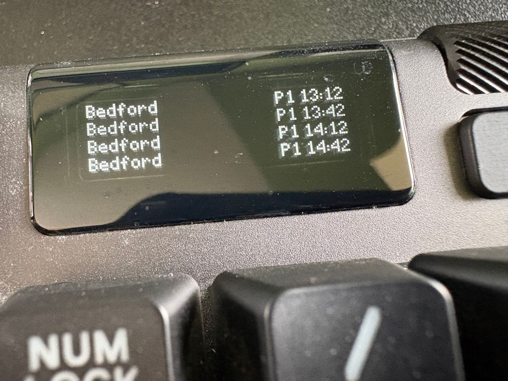

# Apex Pro TKL OLED client

A host-side pull client that streams the RailInfo board to a **SteelSeries Apex Pro TKL**'s
128×40 monochrome OLED via **GameSense**. Unlike the ESP32 clients in this folder, it runs on
the Windows box (the one with SteelSeries GG installed), not on-device — but it's the same
idea: poll the JSON server's `/board` and render a live board.

<p align="center">
  
</p>

*Live on the keyboard: four Bedford departures (P1 13:12 / 13:42 / 14:12 / 14:42), destinations
left and platform+time right, in the shared Dot Matrix font with tabular-aligned times.*

Targets the "Legacy" Apex Pro TKL (2020 / 2023 refresh, firmware `4.16.x`), whose OLED is the
`screened-128x40` GameSense device. The Apex Pro TKL **Gen 3**'s larger colour screen is a
different device type and is not handled here.

## What it shows

Three lines on the OLED:

```
09:10 Bedford            <- next departure: HH:MM + destination
10:10 London Bl 10:14    <- second departure (revised time shown if delayed, CANC if cancelled)
Calling at: London Bl…   <- scrolling marquee of the calling-at line
```

Same status notation as the Pixoo/e-ink boards: on-time shows nothing extra, a delay shows the
revised `HH:MM`, a cancellation shows `CANC` (destination is truncated before the time/status is).

## Prerequisites

1. **SteelSeries GG** installed and running (it hosts the local GameSense server this client
   discovers via `%PROGRAMDATA%\SteelSeries\SteelSeries Engine 3\coreProps.json`).
2. A **RailInfo server** running somewhere on the LAN:
   ```bash
   uv run python -u main.py --serve --port 8000
   ```

## Run

From the repo root, using the project venv (it needs only `httpx`, already a dependency):

```bash
uv run python clients/apexpro/oled_client.py                        # localhost RailInfo + local GG
uv run python clients/apexpro/oled_client.py --railinfo-host 192.168.1.50:8000
uv run python clients/apexpro/oled_client.py --once                 # draw one frame and exit
```

Ctrl+C releases the screen back to GG's normal content.

## Options

| Flag | Default | Meaning |
|------|---------|---------|
| `--railinfo-host` | `localhost:8000` (or `$RAILINFO_HOST`) | RailInfo server, `host:port` or full URL |
| `--view` | `departures` | `departures` \| `all` \| `arrivals` |
| `--refresh` | `0.75` | Screen push cadence in seconds (also the marquee step rate) |
| `--data-interval` | `30` | How often to re-fetch the board from RailInfo |
| `--line-chars` | `21` | Glyphs per line; nudge if text is clipped or too short |

## How it works

Standard GameSense flow (plain HTTP/JSON — no SDK): register the app (`/game_metadata`), bind a
`screen` handler for `screened-128x40` with three text lines fed by context-frame keys
(`/bind_game_event`), then push frames with `/game_event`. Each push also resets GG's ~15 s
deregistration timer, so the display stays ours while the loop runs. The board is re-fetched on
the slower `--data-interval` and reused between pushes so the marquee scrolls without hammering
the server — the same decoupling the Pixoo streamer uses; a failed fetch keeps the last good board.
